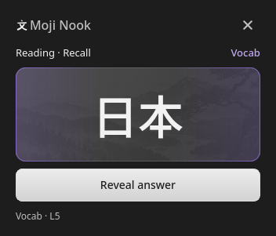
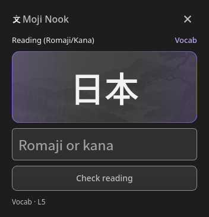
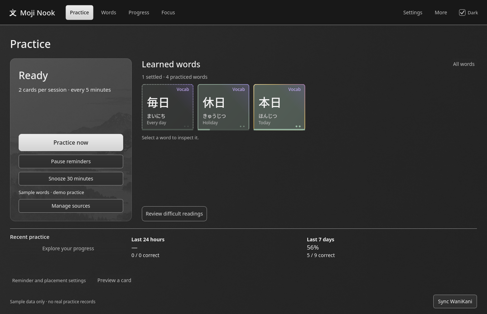

# Moji Nook — a quiet WaniKani companion for Linux

Moji Nook brings short Japanese practice cards over your other windows while you
work, read, or play. A compact card appears in the corner of your screen at an
interval you choose. Answer a couple of cards, then carry on with your day.

It reinforces the kanji and vocabulary you have already learned in WaniKani,
fitting extra practice into the gaps in your day without stealing focus, and it
never changes your WaniKani progress.

> **Early alpha (0.1.0).** Expect rough edges. Tested on Linux x86_64 with KDE
> Plasma on Wayland. See [Get started](#get-started) and please
> [report problems](https://github.com/AsterithUlala/moji-nook/issues).


*A practice card arriving on a KDE Plasma desktop, using sample words. It sits
above your windows and the taskbar while the editor keeps keyboard focus; Moji
Nook itself waits in the system tray.*

## What you practice

- **Your WaniKani words:** connect once and Moji Nook brings in the kanji and
  vocabulary you have already learned.
- **Three ways to answer:** type a reading, pick from multiple choice, or
  rate your own recall. Readings and meanings are practiced separately.
- **Offline pronunciation:** hear Japanese read aloud on the card without a network connection.
- **Extra attention where it helps:** words you have found difficult get more attention in the mix.
- **A record of practice:** each word earns a tile once you have recalled it on
  separate days and after gaps. Tiles persist through mistakes and breaks.

<p>
  
  
</p>

## How it fits into your day

- **Short bursts:** two cards per session by default; choose one to five.
- **Your timing:** a session is offered every five minutes by default, and you
  can change the interval. The next interval starts when you finish or end a session.
- **A quiet overlay:** choose the display and corner. Cards appear without taking
  keyboard focus from your current app; click when you are ready to answer.
- **Easy to put aside:** dismiss a session, pause reminders, or snooze for
  30 minutes. Busy time never builds a backlog, and a dismissed card is not
  counted as a wrong answer.
- **On demand:** start a session any time from the system tray.

Moji Nook runs in the system tray. Closing the dashboard leaves it running; use
**Quit** to stop it.

## Browse your words

Open the dashboard to browse and search the words you have learned, inspect
reading and meaning progress, and see your history and word tiles. Routine
practice happens in the compact cards; the dashboard is there when you want it.

<details>
<summary>See the dashboard and word collection</summary>



[Word collection](docs/previews/word-tiles.png) ·
[Search](docs/previews/word-search.png) ·
[Tile details](docs/previews/word-details.png) ·
[Revealed practice card](docs/previews/card-answer.png) ·
[Light appearance](docs/previews/practice-light.png).

</details>

Tiles mark words you have recalled over time. They are a record of practice, not
a claim that you have mastered a word.

### Anki (secondary)

Moji Nook can also practice a vocabulary deck from desktop Anki through the
AnkiConnect add-on. Support is more limited than WaniKani. See the [Anki setup and limits](docs/USAGE.md#anki) before trying a deck.

## Get started

Moji Nook is an early alpha. It is tested on Linux x86_64 with KDE Plasma on
Wayland (Arch/CachyOS). Other desktops may work but are untested; macOS is not
supported yet.

**Arch Linux and derivatives:** download the `.pkg.tar.zst` package from the
[latest release](https://github.com/AsterithUlala/moji-nook/releases) and install it:

```sh
sudo pacman -U moji-nook-*.pkg.tar.zst
moji-nook --demo   # try sample words, no account needed
```

**Windows (experimental):** download `moji-nook-windows-x64.zip` from the
[latest release](https://github.com/AsterithUlala/moji-nook/releases), extract
it anywhere, and run `moji-nook.exe`. Japanese pronunciation is not included on
Windows yet. See [Windows](docs/INSTALL.md#windows-experimental) for details.

**Other distributions:** build from source.

```sh
git clone https://github.com/AsterithUlala/moji-nook.git
cd moji-nook
cmake -S . -B build -G Ninja -DCMAKE_BUILD_TYPE=RelWithDebInfo
cmake --build build -j 4
./build/moji-nook --demo
```

Dependencies, speech options, and troubleshooting are in the
[installation guide](docs/INSTALL.md). When you are ready for your own words,
close the demo, start Moji Nook normally, follow the
[first-use guide](docs/USAGE.md#connect-your-practice-source) to connect
WaniKani, and choose **Practice now**.

## Your data and privacy

Moji Nook is an independent companion, unaffiliated with WaniKani or Anki. It
only reads from WaniKani and Anki: it never submits WaniKani reviews and never
changes Anki schedules. Your word cache and practice history stay on your
computer. There is no cloud account, analytics service, or cross-device sync.

Practice works offline from the local cache. While it is running and online,
Moji Nook refreshes your word list automatically about once a day. Your WaniKani token is stored
unencrypted in a file only your user account can read. See
[storage, backups, and privacy](docs/USAGE.md#storage-backups-and-privacy).

## Documentation

- [Installation](docs/INSTALL.md) and [usage](docs/USAGE.md).
- [Speech engines and attribution](docs/SPEECH.md).
- [Build and test](docs/INSTALL.md#clone-and-build) and [contributing](CONTRIBUTING.md).

## License

Moji Nook is released under the [MIT License](LICENSE). The bundled Japanese
voices and speech engines keep their own licenses and credit requirements; see
[speech attribution](docs/SPEECH.md#attribution-and-notices).

## Support development

If you would like to support my work on Moji Nook and other apps, you can
[buy me a coffee](https://buymeacoffee.com/asterithulala).
